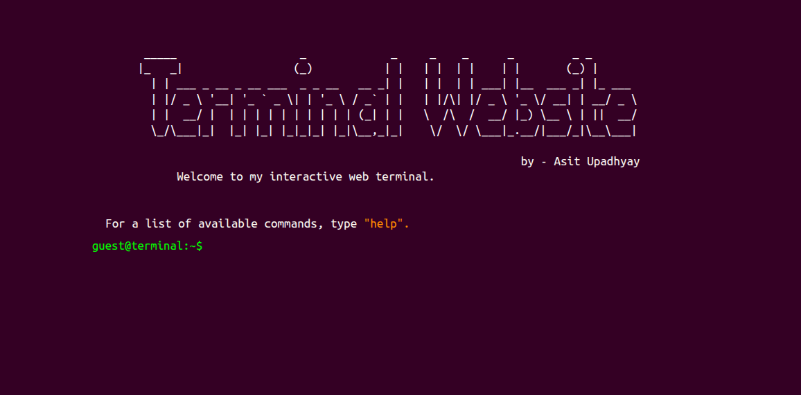

# 🖥️ Terminal Website

Welcome to my **Terminal-Themed Portfolio Website**, a personal project built with pure **HTML, CSS, and JavaScript**, mimicking a terminal/command-line interface experience. Type commands to explore who I am, check out my social links, projects, and a few surprises 👀.

> 🎯 A creative and interactive way to showcase a personal portfolio using a terminal-style interface.

### 🚀 Demo

🔗 [Live Demo](https://terminal-website-iamasit07.vercel.app/)  
📸 Preview:

 <!-- Replace with an actual screenshot if you have one -->

### 🛠️ Built With

- **HTML5** — Structure of the site.
- **CSS3** — Styling the terminal UI, responsiveness, and animations.
- **JavaScript (Vanilla)** — Command handling, input logic, and interactive behavior.

### 📦 Features

- **Interactive Terminal UI** with simulated prompt and response style.
- **Command-based Navigation** – type `help` to get a list of available commands.
- **Fun Easter Egg** – Try to find hidden surprises!
- **Social Links** – Access my GitHub, LinkedIn, Instagram, Codeforces, LeetCode.
- **Project Showcase** – Highlights of current and upcoming projects.
- **Typing Animation** – Simulated slow typing for responses.

---

## 💻 Available Commands

| Command       | Description                      |
| ------------- | -------------------------------- |
| `whoisasit07` | Learn more about me              |
| `whoami`      | Some thoughtful philosophy       |
| `social`      | Links to my social profiles      |
| `projects`    | List of my projects              |
| `email`       | Opens email client to contact me |
| `help`        | List all available commands      |
| `clear`       | Clears the terminal              |
| `banner`      | Show banner again                |
| `exit`        | Closes the terminal tab          |
| `secret`      | A hint to find the Easter Egg... |
| `history`     | Shows the command history        |

---

---

## 📬 Contact

Feel free to reach out or connect with me:

- 📧 [asit.upadhyay793@gmail.com](mailto:asit.upadhyay793@gmail.com)
- 🌐 [Portfolio Website](https://your-website-link.com)
- 🧑‍💻 [GitHub](https://github.com/iamasit07)
- 💼 [LinkedIn](https://www.linkedin.com/in/asit-upadhyay-5b469a207/)

---

## 🧠 Inspiration

This project was inspired by my passion for Linux, terminal aesthetics, and my desire to make portfolio browsing more engaging and fun for the visitor.

---

## ✅ TODO

- Add more commands and functionalities
- Improve mobile responsiveness
- Add typing sounds
- Add animations/transitions
- Deploy on GitHub Pages or Netlify

---

### ⭐️ Show some love

If you like this project, don't forget to ⭐️ this repo!
